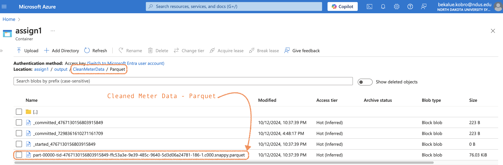
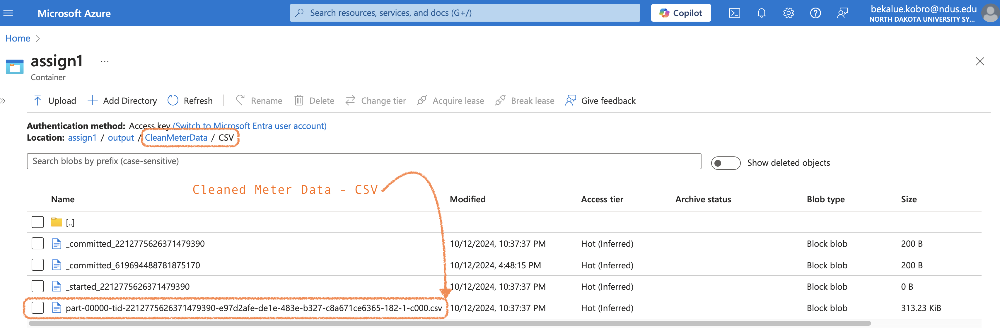
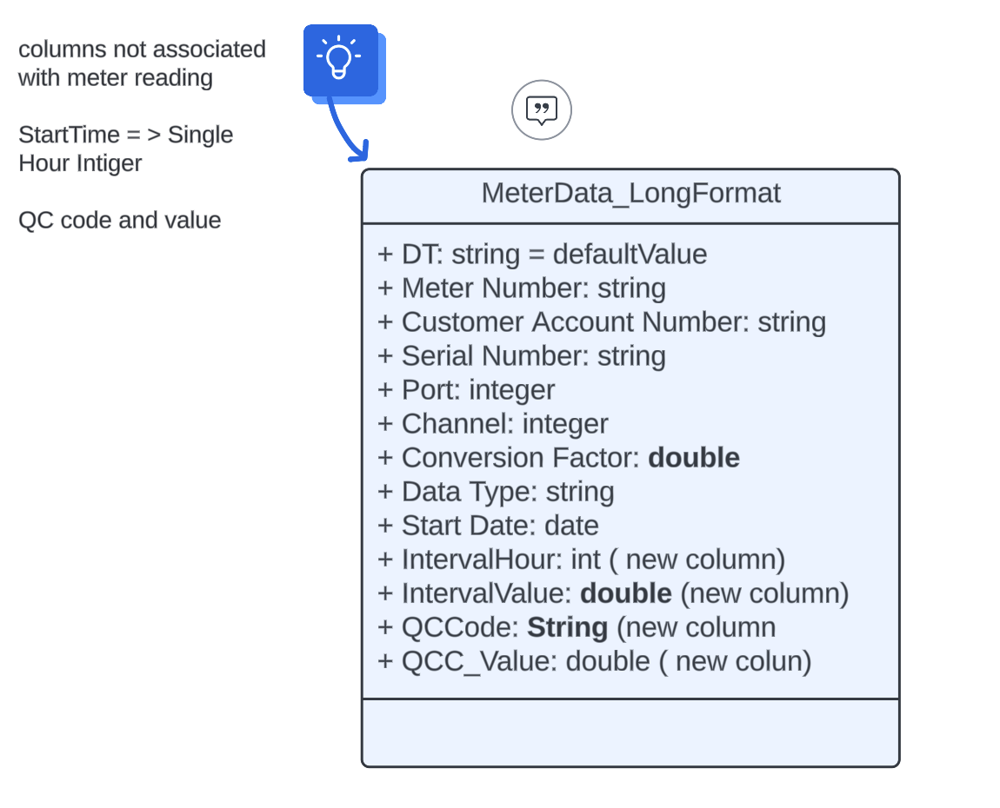
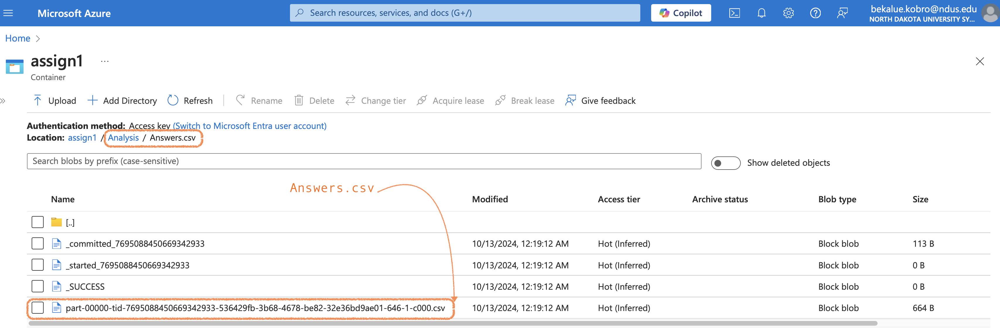

# PySpark Data Wrangling and Analysis: Electrical Meter Reading Data

This project demonstrates data wrangling and analysis using PySpark in Azure Databricks, focusing on cleaning and transforming a mock dataset from an electrical meter reading system. It also showcases querying the cleaned dataset to answer specific analytical questions.

---

## Project Overview

### Dataset Details

- **Source**: Mock data from an electrical meter reading system.
- **Structure**: Each row contains:
  - Customer and meter information.
  - Hourly readings (24 columns) with corresponding QC codes.
- **QC Code**: Only readings with QC code `3` are valid.

Additional metadata about customers and meters is provided in `CustMeter.csv`.

---

## Key Steps

### Data Cleaning Tasks

Using PySpark, the raw data is cleaned and transformed to meet the following requirements:

- **Wide to Long Format**: Each hourly reading is converted into individual rows with columns for:
  - `IntervalHour` (1-24).
  - `QCCode` and `IntervalValue`.
- **Filter Criteria**:
  - Retain valid data types (`KWH`, `UNITS`, `Signed Net in Watts`, `Fwd Consumption in Watts`).
  - Remove bad QC codes (anything other than `3`).
  - Eliminate duplicates.
- **Sorting**: Data is sorted by customer, meter, datatype, date, and interval hour.
- **Output**: Saved in two formats:
  - CSV (`/Output/CSV`)
  - Parquet (`/Output/Parquet`)

### Analysis

The cleaned dataset is analyzed to answer key business questions:

- Questions are addressed by querying the cleaned Parquet dataset.
- Results are standardized into a DataFrame and exported as a CSV file for review.

---

## Deliverables

- **Cleaned Data**: CSV and Parquet files stored in Azure Storage.
- **Analysis Results**: CSV file with answers to analytical queries.
- **Notebooks**: PySpark notebooks for data cleaning (`CleanMeterData.py`) and analysis (`AnalyzeData.py`).

This project highlights proficiency in PySpark, data transformation, and cloud-based data workflows in the context of electrical meter reading data.
